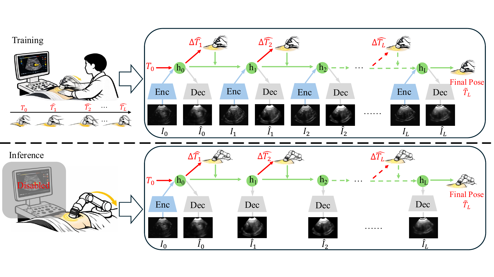

# DreamReg

Official codebase for **DreamReg: Belief-Driven World Model for 2D-3D Ultrasound Registration**, recently accepted by **MICCAI 2026**.

This repository currently contains two dataset-specific pipelines:

- `CAMUS/DreamReg`: cardiac ultrasound registration on CAMUS.
- `Prostate/DreamReg`: prostate ultrasound registration.

## Framework Overview

[](framework_img/overview.pdf)

## Repository Layout

```text
DreamReg/
├── CAMUS/DreamReg/
│   ├── train_wm.py
│   ├── infer_wm_baseline.py
│   ├── models/baseline_wm.py
│   ├── data/
│   └── data_preprocess/CAMUS_preprocess/
├── Prostate/DreamReg/
│   ├── train_wm.py
│   ├── infer_wm_baseline.py
│   ├── models/baseline_wm.py
│   ├── data/
│   └── data_preprocess/Prostate_preprocess/
└── README.md
```

## Environment

The current code imports:

- Python 3.9+
- PyTorch
- NumPy
- `torchgeometry`
- `pytorch-msssim`
- `SimpleITK`
- `matplotlib`
- `tqdm`
- `Pillow`

Example setup:

```bash
conda create -n dreamreg python=3.9 -y
conda activate dreamreg
pip install torch torchvision
pip install numpy matplotlib tqdm pillow SimpleITK torchgeometry pytorch-msssim
```

## Reference and Datasets

This codebase is built on top of [EUReg](https://github.com/ZAX130/EUReg).

Datasets used in this repository:

- CAMUS: https://www.creatis.insa-lyon.fr/Challenge/camus/
- µ-RegPro: https://muregpro.github.io/

## Data Format

The training and evaluation loaders expect pickle files, not raw NIfTI volumes.

### Training pickle format

Training uses volume-only pickles:

```python
(volume_3d, meta)
```

- `volume_3d`: normalized 3D array.
- `meta`: auxiliary metadata dictionary.

### Validation and test pickle format

Evaluation uses fixed slice samples with ground-truth pose:

```python
(volume_3d, volume_mask, slice_2d, slice_mask_2d, dof)
```

For the prostate pipeline, some preprocessing code stores:

```python
(volume_3d, volume_mask, slice_2d, slice_mask_2d, dof, meta)
```

## Preprocessing

The preprocessing scripts are dataset-specific and contain hard-coded path placeholders that must be updated before running them.

### CAMUS

1. Edit:
   - `CAMUS/DreamReg/data_preprocess/CAMUS_preprocess/CAMUS_preprocess_0.py`
   - `CAMUS/DreamReg/data_preprocess/CAMUS_preprocess/CAMUS_preprocess_1.py`
2. Set input and output paths.
3. Run:

```bash
cd CAMUS/DreamReg/data_preprocess/CAMUS_preprocess
python CAMUS_preprocess_0.py
python CAMUS_preprocess_1.py
```

What these scripts do:

- `CAMUS_preprocess_0.py`: resamples and normalizes CAMUS volumes, then saves volume pickles.
- `CAMUS_preprocess_1.py`: builds training/validation/testing splits and generates fixed 2D slices with known 6-DoF pose labels.

Default CAMUS geometry in the current code:

- volume size: `32 x 192 x 192`
- slice size: `192 x 192`
- pose range: `[-10, 10]` for each of 6 DoF

### µ-RegPro

1. Edit:
   - `Prostate/DreamReg/data_preprocess/Prostate_preprocess/Prostate_preprocess_0_fixed.py`
   - `Prostate/DreamReg/data_preprocess/Prostate_preprocess/Prostate_preprocess_1_fixed.py`
2. Set input and output paths.
3. Run:

```bash
cd Prostate/DreamReg/data_preprocess/Prostate_preprocess
python Prostate_preprocess_0_fixed.py
python Prostate_preprocess_1_fixed.py
```

What these scripts do:

- `Prostate_preprocess_0_fixed.py`: resamples/crops/pads prostate ultrasound volumes to `64 x 64 x 64`.
- `Prostate_preprocess_1_fixed.py`: generates fixed 2D slices and saves per-slice pose annotations.

Default Prostate geometry in the current code:

- volume size: `64 x 64 x 64`
- slice size: `64 x 64`
- pose range: translation `[-10, 10]`, rotation `[-10, 10]` degrees

## Training

The training scripts still use hard-coded dataset and output paths. Update them before running:

- `train_dir`
- `val_dir`
- `test_dir`
- `save_dir`
- optional `CUDA_VISIBLE_DEVICES`

### CAMUS training

```bash
cd /Media_HDD/lykang/DreamReg/CAMUS/DreamReg
python train_wm.py --wm_steps 7 --step_scale 1.0 --noise_std 2.0
```

### µ-RegPro training

```bash
cd /Media_HDD/lykang/DreamReg/Prostate/DreamReg
python train_wm.py --wm_steps 5 --step_scale 1.0 --noise_std 2.0
```

Training outputs are written under:

- `experiments/.../<save_dir>/best_model.pth.tar`
- `logs/<save_dir>/`

## Inference and Evaluation

Inference scripts also require local path edits before use:

- dataset path (`val_dir` or testing directory)
- `save_dir`
- checkpoint path

### CAMUS inference

```bash
cd /Media_HDD/lykang/DreamReg/CAMUS/DreamReg
python infer_wm_baseline.py --wm_steps 7 --step_scale 1.0 --gpu 0
```

### µ-RegPro inference

```bash
cd /Media_HDD/lykang/DreamReg/Prostate/DreamReg
python infer_wm_baseline.py --wm_steps 5 --step_scale 1.0 --gpu 0
```

The inference scripts report:

- `DistErr`
- `NCC`
- `SSIM`
- translation error
- rotation error
- parameter NCC
- FPS

They also save predicted slices into `showdata/<save_dir>/`.

## Pretrained Checkpoints

Pretrained model weights are available on Google Drive:

- CAMUS: [Google Drive](https://drive.google.com/drive/folders/1JH3n3E-vQrpcjqjCx1qoYqdIov0nCWS-?usp=sharing)
- µ-RegPro: [Google Drive](https://drive.google.com/drive/folders/1fH5Xm7C3amK__xbLPid-Jmr43ZHdZmHG?usp=sharing)

After downloading, place the checkpoint under the corresponding `experiments/.../<save_dir>/` folder, or update the inference script to point to the downloaded file directly.

## Important Notes

- The codebase is dataset-specific rather than fully configurable.
- Many paths are placeholders such as `/path/to/...` and must be replaced manually.
- Several data utilities call `.cuda()` directly, so GPU execution is assumed in parts of the pipeline.

## Citation

The paper does not have a public online version yet. The citation entry will be updated after release.

```bibtex
@inproceedings{dreamreg2026,
  title     = {DreamReg: Belief-Driven World Model for 2D-3D Ultrasound Registration},
  booktitle = {MICCAI},
  year      = {2026},
  note      = {To be updated after the official online release}
}
```
